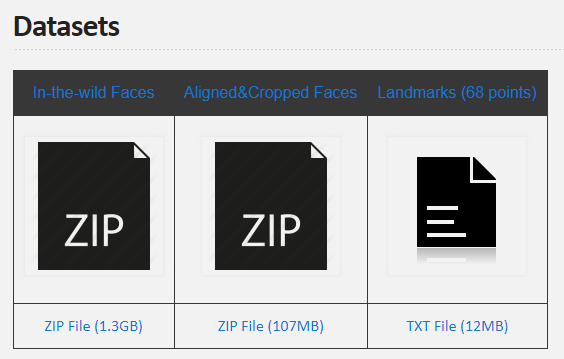

## UTKFace

### Large Scale Face Dataset

### Introduction
UTKFace dataset is a large-scale face dataset with long age span (range from 0 to 116 years old). The dataset consists of over 20,000 face images with annotations of age, gender, and ethnicity.

### Highlights
* consists of 20k+ face images in the wild (only single face in one image)
* provides the correspondingly aligned and cropped faces
* provides the corresponding landmarks (68 points)
* images are labelled by age, gender, and ethnicity

### Labels
The labels of each face image is embedded in the file name, formated like [age]_[gender]_[race]_[date&time].jpg

* [age] is an integer from 0 to 116, indicating the age
* [gender] is either 0 (male) or 1 (female)
* [race] is an integer from 0 to 4, denoting White, Black, Asian, Indian, and Others (like Hispanic, Latino, Middle Eastern).
* [date&time] is in the format of yyyymmddHHMMSSFFF, showing the date and time an image was collected to UTKFace

Related Work: Paper - https://arxiv.org/abs/1702.08423 

Data taken from: https://susanqq.github.io/UTKFace/

